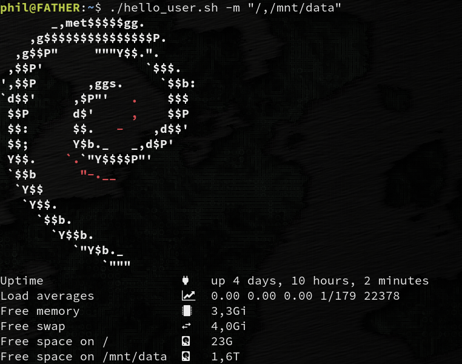

# hello_user
Simple greeting script for Linux. Add to .bashrc

Neofetch wanted to pull 26 MB of dependencies when I wanted to install it on my Debian server so I made this instead.

It will display a distro banner and some system info:
- uptime
- load averages
- free memory
- free swap
- free space on /
- (optionally) free space on other mounting points

## Dependencies
- linux_logo (https://github.com/deater/linux_logo)
- NerdFonts (https://www.nerdfonts.com/) (optional)
- uptime
- head
- tail
- awk
- column

## Installation
- Download
- Install in your scripts folder
- Add to .bashrc
- Make sure your terminal uses a NerdFont (or use --no-icons)

## Usage

- Display the logo and system info like shown above
  > hello_user

- Also display free space on /mnt/data
  > hello_user /mnt/data

- Don't display the icons
  > hello_user --no-icons

## TODO
- [ ] configure --prefix=/usr ?
- [ ] make install
- [ ] man page
- [ ] DEB package
- [ ] AUR package
- [ ] RPM ?
